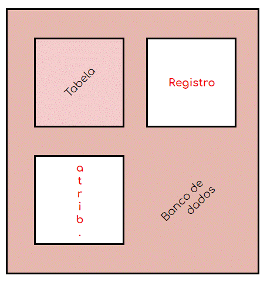
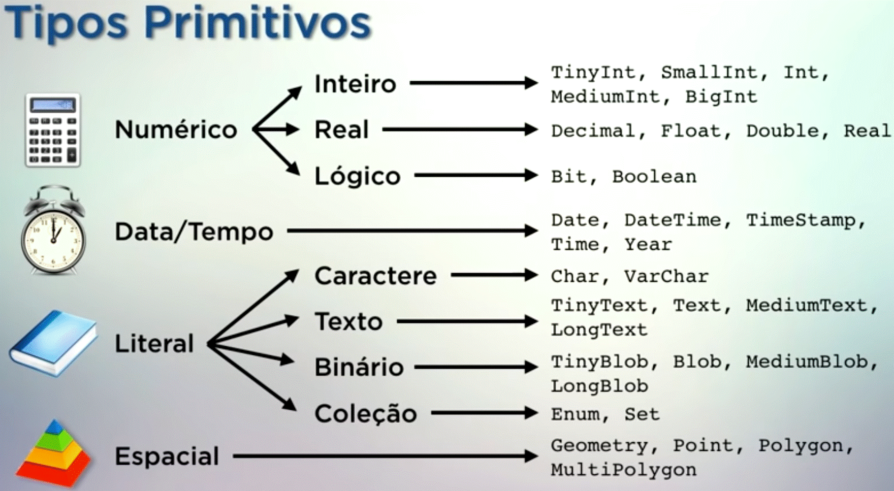

&nbsp; &nbsp; &nbsp; Este repositório contém anotações pessoais sobre MySQL. Criado com intuito de agrupar soluções de algumas dúvidas simples que eventualmente surjam no gerenciamento de um banco de dados.  
***

### Banco de Dados

  

### Divisão dos "comandos" por funcionalidade

**DDL - Linguagem de Definição de Dados**

* [CREATE](comandos/criar.sql "Clique para ver algumas utilizações desse \"comando\"")  

* [ALTER](comandos/alterar.sql "Clique para ver algumas utilizações desse \"comando\"")  

* [DROP](comandos/excluir.sql "Clique para ver algumas utilizações desse \"comando\"")  

 

**DML - Linguagem de Manipulação de Dados**

* [INSERT](comandos/adicionar.sql "Clique para ver algumas utilizações desse \"comando\"")  

* [UPDATE](comandos/alterar.sql "Clique para ver algumas utilizações desse \"comando\"")

* [DELETE](comandos/excluir.sql "Clique para ver algumas utilizações desse \"comando\"")  

* [TRUNCATE](comandos/excluir.sql "Clique para ver algumas utilizações desse \"comando\"")

 

**DQL - Linguagem de Consulta de dados**

* [SELECT](comandos/conferir.sql "Clique para ver algumas utilizações desse \"comando\"")

### Tipos de dados

  

### [Alguns Operadores](notas/operadores.md "Clique para ver algumas utilizações desse \"comando\"")  

### [Modelo relacional](notas/modelo-relacional.md "Clique para ver algumas utilizações desse \"comando\"")  

*** 
&nbsp; &nbsp; &nbsp; As videoaulas lincadas nesse documento, assim como algumas imagens são de autoria do canal de YouTube 'curso em vídeo'. Ótimo conteúdo gratuito fornecido pelo professor Guanabara.  
