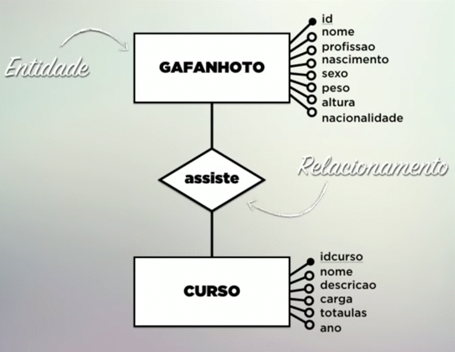
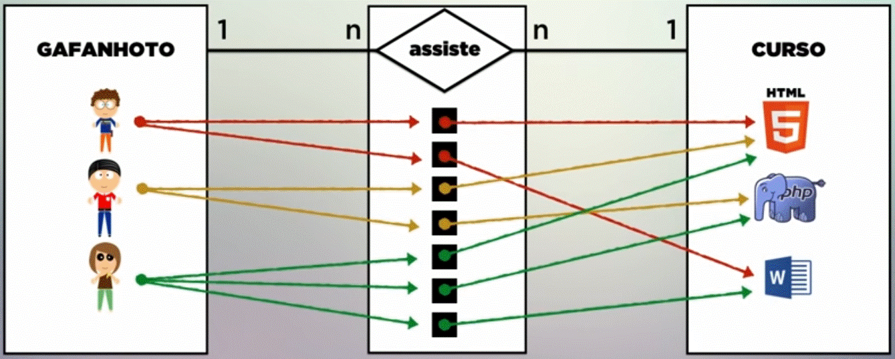

# Modelo Relacional

**O modelo relacional permite fazer relações entre registro de tabelas diferentes.**  

&nbsp; &nbsp; &nbsp; Com isso é possível economizar espoço. E também garantir que um registro que esteja relacionado com outro não possa ser apagado.  

 

## Diagrama Entidade Relacionamento

`| entidade A | x ------- < relação > ------- z | entidade B |`  

_Imagem do canal [curso em video](https://www.youtube.com/watch?v=paZNDJAPT4E&list=PLHz_AreHm4dkBs-795Dsgvau_ekxg8g1r&index=16)._

 

_Exemplo de relação:_  

`| vaca | 1 ------- < cria > ------- N | terneiro |`  

&#9755; cada `vaca` cria `N` terneiros  

&#9754; cada `terneiro` é criado por `1` vaca 

 

## Chave Estrangeira  

&nbsp; &nbsp; &nbsp; A relação de uma tabelas (entidades) com outra é dada pela presença da chave estrangeira, chave essa que está ligada a chave primária da outra tabela. É como uma tabela cedesse uma cópia da sua chave para que outra tabela possa acessar (se relacionar) com seu registros.  

#### Como é feita a troca de chaves estrangeiras  

🔴 🔵 🟢 _chave primaria_  
🟥 🟦 _chave estrangeira_  

 

**Relação UM para UM**  

`| 🔴 A | 1 ------- < relação > ------- 1 | 🔵 B 🟥 |`  

B cria uma "cópia" da chave primaria de A, isso é uma chave estrangeira, B pode relacionar seu registros a registros de A. Poderia ser o contrário.   

**Relação UM para MUITOS**  

`| 🔴 A | 1 ------- < relação > ------- N | 🔵 B 🟥 |`  

`B` recebe uma chave estrangeira de `A`, pois cada `B` só tem uma relação com `A`. O contrário não faria sentido. (Associar uma única vaca para cada terneiro)   

**Relação MUITOS para MUITOS**

Esta imagem do canal [curso em video](https://www.youtube.com/watch?v=paZNDJAPT4E&list=PLHz_AreHm4dkBs-795Dsgvau_ekxg8g1r&index=17) é um exemplo desta relação. Cria-se uma nova entidade para intermediar as outras duas entidades. No exemplo da imagem, cada C (assistida) é feita por um aluno e é direcionada a um curos, caímos no caso 1 para N.

`| 🔴 A | 1 ------- N | 🟢 C 🟥 🟦 | N ------- 1 | 🔵 B |` 

A nova entidade `C` recebe chaves extrangeiras de `A` e `B`. 